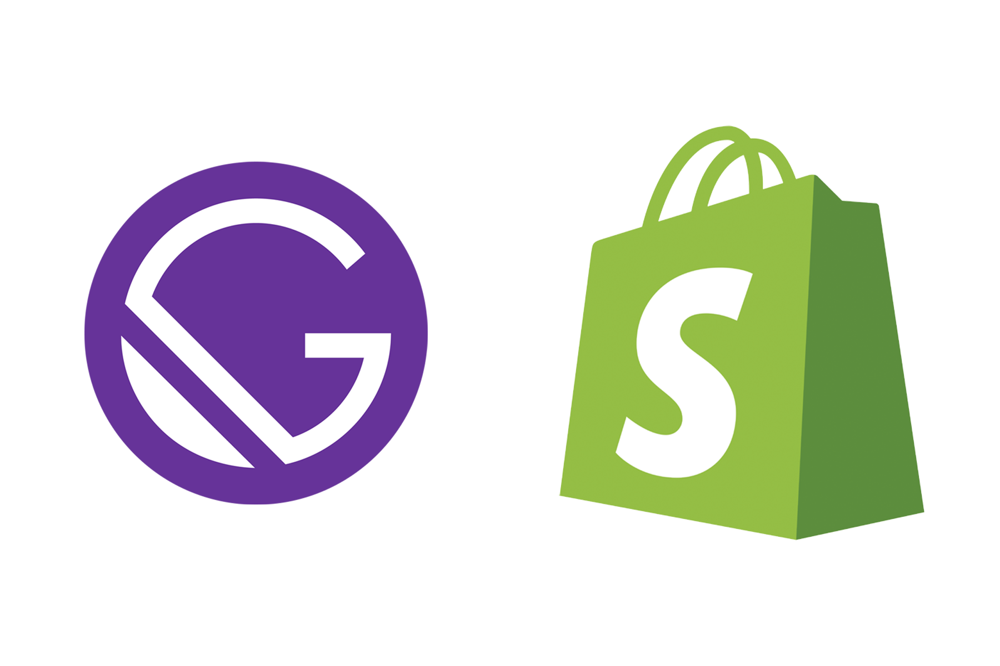

<!-- AUTO-GENERATED-CONTENT:START (STARTER) -->

    

<h1 align="center">
  Starter Gatsby Shopify
</h1>

Kick off your project with this ecommerce website. This starter ships with the main Gatsby configuration files you might need to get up and running blazing fast with the blazing fast app generator for React.

This starter also includes credentials to a Shopify demo store so you can try it out immediately without having to start a store. To use your own just change the values inside of .env.

For project : 4nkit5hukla@gmail.com 🤙🏻

## 🔥 Featured

- Cart
- Product grid with all products
- Filter products
- Sort products
- Product page
- Dynamic Inventory Checking
- Image optimization with Gatsby Image
- Search Bar
- Google Analytics
- SEO
- Customer account from Shopify Store
  - Create customer account
  - Log in customer account
  - Reset Password
  - See all orders
  - Order detail
  - See all addresses (Can Create, Update, Delete and choose default address)

## 💫 Deploy

<!-- AUTO-GENERATED-CONTENT:END -->
